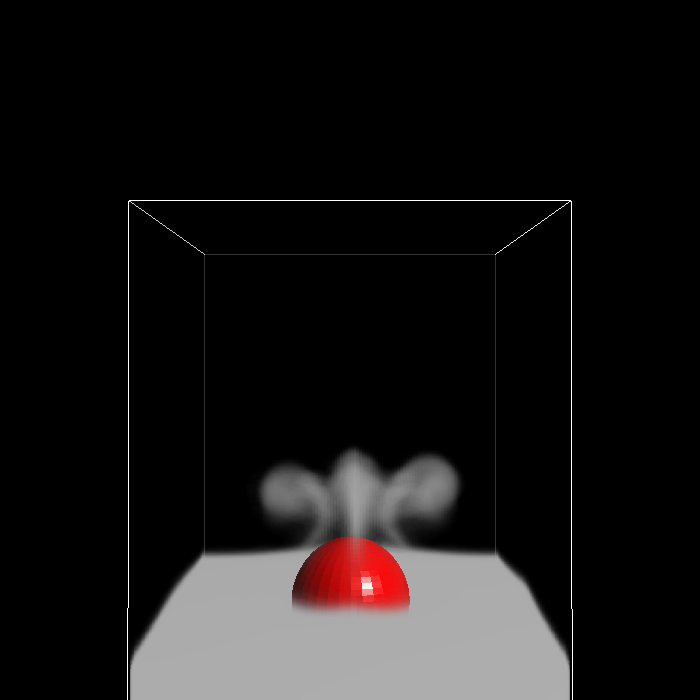

============================================
#Introduction
This code conducts a two-way coupled simulation between a single phase fluid and deformable solids. It implements the method described in the following paper:

Eulerian Solid-Fluid Coupling.

Yun Teng, David I.W. Levin, and Theodore Kim. SIGGRAPH Asia 2016.

The 3D rubber ball example from the paper has been provided in this code.

============================================
#Third-party libraries
The only external dependencies not included in this release are libpng and zlib, which can be easily installed using MacPorts or its equivalent. Libpng is used to write out opengl snapshots and zlib is used to read/write compressed grid data.

The [Eigen] (http://eigen.tuxfamily.org/) library is used for the linear algebra routines. We did a slight modification in Eigen/src/SparseCore/SparseUtil.h: the following three lines were added in the Triplet class:

Index& row() { return m_row; }

Index& col() { return m_col; }

Scalar& value() { return m_value; }

Other third party libraries include:

...[dtgrid](https://code.google.com/p/dt-grid/), for generating as well as looking up narrow-banded signed distance field (SDF).
...[deformCD](http://gamma.cs.unc.edu/DEFORMCD/), for BVH triangle-triangle collision.
...[glvu](http://www.cs.unc.edu/~walk/software/glvu/), for OpenGL navigation, etc. All calls to GLVU are restricted to include/util/VIEWER.h and include/util/VIEWER.inl so you can easily swap to your own favoriate OpenGL navigator.

============================================
#Compiling the code

This code has been successfully built on Mac OSX 10.10. By default it builds without OpenMP using the default Clang compiler. To compile with OpenMP, set USING\_OPENMP to 1 in include/SETTINGS.h and replace common.osx.inc with common.osx.openmp.inc under the projects folder. We used Homebrew to install the OpenMP/Clang compiler following the instructions on https://clang-omp.github.io/.

Once all the necessary changes are made in common.inc, call make from the root directory. It will recurse down into the projects directories and build all the necessary binaries. The binaries will be deposited in the bin directory.

============================================
#Usage:

All binaries uses our customized config file. Please see the config direcotry for a few examples. 

From the root directory, execute the following commands:

./bin/rasterizeSolid ./cfg/sphere.cfg

This rasterizes a solid's mass on to a grid using the solid's signed distance field. The resulting file will be loaded by the simulator for solid mass lookup.

./bin/rubberBall ./cfg/ball.lowres.cfg

This is a lowres simulation of a rubber ball falling onto a carpet of fluid. 250 frames will be computed. The result video is at renders/rubberball_lowres.mov

A highres configuration is provided in cfg/ball.highres.cfg We recommend compiling the code with openmp before running the highres version. The result video is at renders/rubberball_highres.mov